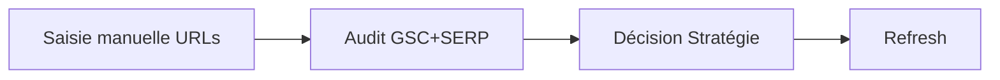
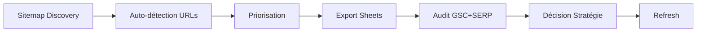

# Sitemap Discovery Tool

**Auto-découverte d'URLs à auditer depuis les sitemaps des blogs**

Version : 1.0
Date : Février 2026

---

## Vue d'Ensemble

Le **Sitemap Discovery Tool** permet d'automatiser la découverte d'URLs à auditer en analysant les sitemaps XML des blogs, sans saisie manuelle dans Google Sheets.

### Fonctionnalités Clés

✅ **Détection nouvelles URLs** : Identifie les articles publiés depuis le dernier crawl
✅ **Identification contenu obsolète** : Trouve les articles > X mois sans mise à jour
✅ **Priorisation automatique** : Score 1-5 basé sur l'âge du contenu
✅ **Cache intelligent** : Évite les crawls répétés, détecte les changements
✅ **Multi-tenant** : Supporte les 6 blogs simultanément

---

## Architecture

### Modules

```
scripts/sitemap/
├── fetcher.py           # Récupération et parsing des sitemaps XML
├── analyzer.py          # Analyse et priorisation du contenu
├── config_adapter.py    # Adaptateur vers les configs blog JSON
└── __init__.py
```

### Stockage Cache

```
_shared/temp/sitemaps/{blog_id}/sitemap_cache.json
```

Le cache contient :
- Liste complète des URLs avec lastmod, changefreq, priority
- Timestamp du dernier fetch
- Permet la détection de changements (nouvelles/supprimées)

---

## Usage

### 1. Découvrir Nouvelles URLs

Détecte les articles publiés depuis le dernier crawl :

```bash
python sitemap_discovery.py --blog enseigna --detect-new
```

**Output** :
```
📡 Découverte nouvelles URLs pour enseigna...
  ✅ URLs actuelles: 157
  📊 URLs précédentes: 128
  🆕 Nouvelles URLs: 29
  ❌ URLs supprimées: 0
```

### 2. Trouver Contenu Obsolète

Identifie les articles nécessitant un refresh :

```bash
python sitemap_discovery.py --blog enseigna --find-stale --months 6
```

**Output** :
```
🔍 Recherche contenu obsolète pour enseigna (> 6 mois)...
  ✅ URLs obsolètes trouvées: 73

  📊 Répartition par priorité:
    ⭐⭐⭐⭐⭐ Priorité 5: 45 URLs (> 1 an)
    ⭐⭐⭐⭐ Priorité 4: 18 URLs (> 9 mois)
    ⭐⭐⭐ Priorité 3: 10 URLs (> 6 mois)
```

### 3. Filtrer par Priorité

N'afficher que les priorités hautes :

```bash
python sitemap_discovery.py --blog enseigna.fr --find-stale --months 12 --min-priority 4
```

### 4. Tous les Blogs Simultanément

Analyser les 6 blogs d'un coup :

```bash
python sitemap_discovery.py --all-blogs --find-stale --months 6 --min-priority 3
```

### 5. Export vers Google Sheets (TODO)

Fonctionnalité en cours d'implémentation :

```bash
python sitemap_discovery.py --blog enseigna --find-stale --export-to-sheets --dry-run
```

---

## Échelle de Priorité

| Priorité | Âge Contenu | Action Recommandée |
|----------|-------------|-------------------|
| ⭐⭐⭐⭐⭐ 5 | > 365 jours (1 an) | **REFRESH URGENT** |
| ⭐⭐⭐⭐ 4 | > 270 jours (9 mois) | Refresh haute priorité |
| ⭐⭐⭐ 3 | > 180 jours (6 mois) | Refresh moyenne priorité |
| ⭐⭐ 2 | > 120 jours (4 mois) | Refresh basse priorité |
| ⭐ 1 | > 90 jours (3 mois) | Monitoring |

---

## Cas d'Usage

### Use Case 1 : Audit Initial d'un Blog

**Objectif** : Identifier tout le contenu obsolète pour prioriser les refreshes.

```bash
# Trouver tout le contenu > 6 mois
python sitemap_discovery.py --blog enseigna --find-stale --months 6 --min-priority 3

# Résultat : 128 URLs obsolètes
# Action : Ajouter les priorités 5 et 4 (101 URLs) dans Google Sheets pour refresh
```

### Use Case 2 : Monitoring Hebdomadaire

**Objectif** : Détecter les nouvelles publications et le contenu devenu obsolète.

```bash
# Chaque lundi matin (cron job)
python sitemap_discovery.py --all-blogs --detect-new --find-stale --months 4

# Action automatique :
# - Nouvelles URLs → Audit GSC + SERP
# - URLs obsolètes → Ajout dans queue de refresh
```

### Use Case 3 : Campagne de Refresh Massive

**Objectif** : Refresh systématique de tout le contenu > 1 an.

```bash
# Trouver tout le contenu > 1 an (priorité 5 uniquement)
python sitemap_discovery.py --all-blogs --find-stale --months 12 --min-priority 5

# Résultat typique : 300-500 URLs sur les 6 blogs
# Action : Planifier refresh par vagues de 50 URLs/semaine
```

### Use Case 4 : Focus Blog YMYL

**Objectif** : Refresh urgent pour blogs santé/finance (YMYL).

```bash
# enseigna et enseigna : YMYL VERY HIGH
python sitemap_discovery.py --blog enseigna --find-stale --months 4 --min-priority 4
python sitemap_discovery.py --blog enseigna --find-stale --months 4 --min-priority 4

# Action : Priorité absolue pour ces URLs (disclaimers, sources médicales)
```

---

## Intégration Workflow

### Workflow Actuel (Google Sheets)



### Workflow avec Sitemap Discovery



**Gain** : Étape manuelle de sélection d'URLs éliminée.

---

## Modèles de Données

### SitemapURL

```python
@dataclass
class SitemapURL:
    loc: str              # URL complète
    lastmod: str | None   # Date dernière modif (ISO 8601)
    changefreq: str | None  # always, hourly, daily, weekly, monthly, yearly, never
    priority: float | None  # 0.0 - 1.0
    slug: str             # Slug extrait de l'URL
```

### StaleContent

```python
@dataclass
class StaleContent:
    url: str                  # URL complète
    lastmod: str | None       # Date dernière modif
    days_since_update: int    # Âge en jours (-1 si inconnu)
    slug: str                 # Slug
    refresh_priority: int     # 1-5 (5 = urgent)
```

---

## Configuration Blog

Chaque blog peut spécifier l'URL de son sitemap dans sa config JSON :

```json
{
  "blog_id": "enseigna",
  "domain": "enseigna",
  "sitemap_url": "https://enseigna/sitemap.xml",
  ...
}
```

**Auto-découverte** : Si `sitemap_url` est vide, le fetcher essaie automatiquement :
- `https://{domain}/sitemap.xml`
- Supporte les sitemap index (récursivement)

---

## Limitations & Roadmap

### Limitations Actuelles

⚠️ **Export Sheets** : Pas encore implémenté (affiche CSV pour import manuel)
⚠️ **GSC Integration** : Pas de cross-référencement avec données GSC (impressions, CTR)
⚠️ **Pas de filtrage** : Impossible d'exclure certaines sections (ex: /category/, /tag/)

### Roadmap

🔜 **V1.1** : Export direct vers Google Sheets (ajout batch dans SheetsClient)
🔜 **V1.2** : Cross-référencement sitemap ↔ GSC (priorisation basée impressions)
🔜 **V1.3** : Filtres URL (patterns regex, sections à exclure)
🔜 **V2.0** : Intégration complète dans `main.py` (mode `--sitemap-discovery`)

---

## Exemples Réels

### Exemple 1 : enseigna

```bash
$ python sitemap_discovery.py --blog enseigna --find-stale --months 6

🔍 Recherche contenu obsolète pour enseigna (> 6 mois)...
  ✅ URLs obsolètes trouvées: 128

  📊 Répartition par priorité:
    ⭐⭐⭐⭐⭐ Priorité 5: 73 URLs
    ⭐⭐⭐⭐ Priorité 4: 28 URLs
    ⭐⭐⭐ Priorité 3: 27 URLs

  Top 10 URLs à refresh en priorité:
    1. ⭐⭐⭐⭐⭐ https://enseigna/quel-est-le-prix-dun-cours-particulier/
       Âge: 702 jours (1.9 ans)
    2. ⭐⭐⭐⭐⭐ https://enseigna/ou-peut-on-donner-des-enseigna/
       Âge: 702 jours
    ...
```

**Analyse** :
- 73 articles > 1 an → Refresh urgent (données Parcoursup obsolètes)
- Priorité haute pour articles "cours particuliers" (forte concurrence)

### Exemple 2 : enseigna (YMYL)

```bash
$ python sitemap_discovery.py --blog enseigna --find-stale --months 4 --min-priority 4

🔍 Recherche contenu obsolète pour enseigna (> 4 mois)...
  ✅ URLs obsolètes trouvées: 45

  📊 Répartition par priorité:
    ⭐⭐⭐⭐⭐ Priorité 5: 32 URLs
    ⭐⭐⭐⭐ Priorité 4: 13 URLs
```

**Action** :
- YMYL VERY HIGH → Refresh immédiat requis
- Ajouter disclaimers santé + sources médicales récentes

---

## Maintenance

### Purger le Cache

Pour forcer un re-fetch complet :

```bash
rm -rf _shared/temp/sitemaps/
```

### Vérifier la Santé du Cache

```bash
ls -lh _shared/temp/sitemaps/*/sitemap_cache.json
```

### Fréquence Recommandée

- **Nouvelles URLs** : Hebdomadaire (chaque lundi)
- **Contenu obsolète** : Mensuel (1er du mois)
- **Purge cache** : Jamais (détection automatique)

---

## Support

### Blogs Supportés

| Blog ID | Domain | Sitemap Status |
|---------|--------|----------------|
| enseigna | enseigna.fr | ✅ Auto-découverte |
| enseigna | enseigna | ✅ Auto-découverte |
| enseigna | enseigna | ✅ Auto-découverte |
| enseigna | enseigna | ✅ Auto-découverte |
| enseigna | enseigna | ✅ Auto-découverte |
| enseigna | enseigna | ✅ Auto-découverte |

### Dépendances

- Python 3.10+
- `requests` (fetch HTTP)
- `xml.etree.ElementTree` (parsing XML)
- Configs blog JSON dans `_shared/config/blogs/`

---

## Conclusion

Le **Sitemap Discovery Tool** automatise la phase de découverte d'URLs, éliminant la saisie manuelle et permettant un monitoring continu du contenu obsolète. Intégration complète prévue en V2.0 avec export direct vers Google Sheets.

**Usage recommandé** : Lancer hebdomadairement pour détecter nouvelles URLs + mensuellement pour refresh systématique du contenu obsolète.

---

*Documentation mise à jour : Février 2026*
*Version outil : 1.0*
